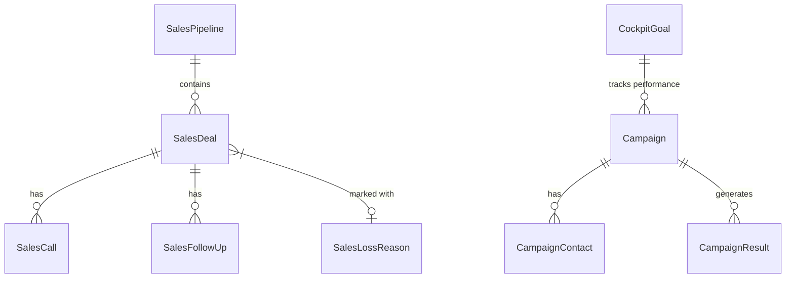

# Design Specification: Sales Module

This document outlines the design, architecture, and user flows of the Sales Module in the Laravel CRM application. It serves as the specification for stitch.withgoogle.com.

---

## 1. Overview & Objectives
The Sales Module is a comprehensive CRM subsystem designed to manage the entire sales pipeline, from lead generation and campaigns to deal closure and performance tracking.

Key capabilities:
- **Sales Cockpit**: Centralized dashboard for sales reps to track daily goals, follow-ups, and key metrics.
- **Deals & Pipeline Management**: Visual Kanban board and list views for tracking deals across pipeline stages.
- **Call Center & Campaign Management**: Tools to execute outbound sales campaigns and manage lead lists.
- **Follow-ups & Tasks**: Activity scheduling and execution (calls, tasks, reminders).

---

## 2. Core Entities & Database Schema
The module relies on the following database models (defined under `Modules/Sales/App/Models`):

- **SalesPipeline**: Defines stages of the sales process.
- **SalesDeal**: Tracks opportunities, value, close dates, stages, and status (Won/Lost/Open).
- **Campaign**: Groups contacts for targeted calling/outreach campaigns.
- **CockpitGoal**: Tracks key performance indicators (KPIs) and monthly/weekly sales quotas.

---

## 3. UI Components & Livewire Architecture
The user interface is powered by Laravel Livewire components located in `Modules/Sales/App/Livewire`.

### Key Interface Views:
1. **Sales Cockpit (`CockpitMain`)**:
   - **File**: `CockpitMain.php` / `cockpit-main.blade.php`
   - **Function**: The landing page for sales representatives showing today's tasks, active goals, and campaign statuses.
2. **Deals & Pipeline Kanban (`PipelineKanban`)**:
   - **File**: `PipelineKanban.php`
   - **Function**: Interactive drag-and-drop board for moving deals between pipeline stages.
3. **Deal Details (`Deal360View` & `DealTab`)**:
   - **File**: `Deal360View.php` / `DealTab.php`
   - **Function**: Comprehensive 360-degree profile of a deal showing its history, contacts, calls, and follow-ups.
4. **Call Center Dashboard (`CallCenterTab`)**:
   - **File**: `CallCenterTab.php`
   - **Function**: Dynamic interface for making calls, logging outcomes, and loading campaign contact lists.

---

## 4. Key User Flows (Stitch Interaction Scenarios)

### Flow A: Deal Progression (Kanban to 360 View)
1. **Trigger**: Sales agent views the Kanban board (`PipelineKanban`).
2. **Action**: Agent drags a deal card from "Proposal" to "Negotiation".
3. **Execution**: Livewire fires an update event, modifying the `stage_id` on the `SalesDeal` record and logging the transition.
4. **Detailing**: Agent clicks the deal to open the `Deal360View` modal/tab to add notes.

### Flow B: Active Outbound Campaign
1. **Trigger**: Agent starts an assigned Campaign.
2. **Action**: The system loads the next contact in `CallCenterTab`.
3. **Execution**: The agent triggers a call. On completion, the agent logs the outcome (e.g., "Interested", "No Answer").
4. **Result**: `CampaignContact` status is updated, and a `SalesCall` log is attached. If positive, a `SalesDeal` is generated.

### Flow C: Goal Tracking & Analytics
1. **Trigger**: Sales manager sets monthly targets using `CockpitGoalManager`.
2. **Result**: Reps see progress rings/bars on their `CockpitMain` dashboard reflecting actual wins against the target.

---

## 5. Styling & Visual Guidelines
- **Theme**: Premium Dark Mode supported.
- **Colors**: High-contrast, tailored palette (e.g., Success/Green for Won Deals, Warning/Amber for Pending Deals, Info/Blue for Active Campaigns).
- **Typography**: Clean sans-serif hierarchy matching the main CRM application style.
- **Components**: Standardized modal dialogues and card layouts with subtle hover transitions.
